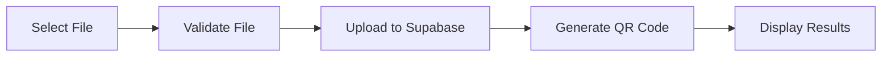

# 📄 QR Doc Share

> **Share documents instantly with QR codes** - Upload, generate, and share documents seamlessly with anyone, anywhere.

<div align="center">


</div>

## ✨ Features

🚀 **Instant Upload** - Drag & drop or click to upload PDF, DOC, and DOCX files  
📱 **QR Code Generation** - Automatically generates scannable QR codes for each document  
☁️ **Cloud Storage** - Secure file storage with global CDN distribution  
📥 **Direct Download** - QR codes link directly to downloadable files  
🎨 **Modern UI** - Clean, responsive design with smooth animations  
⚡ **Lightning Fast** - Frontend-only architecture for maximum performance  

## 🛠️ Tech Stack

### Frontend
- **Vue 3** - Progressive JavaScript framework with Composition API
- **TypeScript** - Type-safe development experience
- **Vite** - Next-generation frontend build tool
- **Tailwind CSS** - Utility-first CSS framework
- **Vue Router** - Official routing library for Vue.js

### Backend & Storage
- **Supabase** - Open-source Firebase alternative
- **Supabase Storage** - Scalable file storage with CDN

### Libraries & Tools
- **QRCode.js** - QR code generation library
- **QRCode Vue3** - Vue 3 QR code component
- **Heroicons** - Beautiful hand-crafted SVG icons
- **AOS** - Animate On Scroll library
- **UUID** - Unique identifier generation

## 🚀 Quick Start

### Prerequisites
- Node.js 18+ 
- pnpm (recommended) or npm

### Installation

1. **Clone the repository**
   ```bash
   git clone https://github.com/yourusername/qr-doc-share.git
   cd qr-doc-share
   ```

2. **Install dependencies**
   ```bash
   pnpm install
   ```

3. **Set up Supabase**
   - Create a new project at [supabase.com](https://supabase.com)
   - Create a storage bucket named `documents`
   - Make the bucket public
   - Add storage policies for public read/write access

4. **Configure environment variables**
   ```bash
   cp .env.example .env
   ```
   
   Update `.env` with your Supabase credentials:
   ```env
   VITE_SUPABASE_URL=your_supabase_project_url
   VITE_SUPABASE_ANON_KEY=your_supabase_anon_key
   ```

5. **Start development server**
   ```bash
   pnpm dev
   ```

6. **Open your browser**
   ```
   http://localhost:5173
   ```

## 📖 How It Works

### 1. **Upload Process**


### 2. **File Sharing**
- User uploads document (PDF, DOC, DOCX)
- File is stored securely in Supabase Storage
- QR code is generated with direct download link
- Anyone can scan QR code to download the file instantly

### 3. **Supported File Types**
- 📄 **PDF** - Portable Document Format
- 📝 **DOC** - Microsoft Word Document (Legacy)
- 📝 **DOCX** - Microsoft Word Document (Modern)
- 📏 **Size Limit** - Up to 10MB per file

## 🏗️ Project Structure

```
qr-doc-share/
├── src/
│   ├── components/          # Reusable Vue components
│   ├── views/              # Page components
│   │   ├── Home.vue        # Landing page
│   │   ├── Upload.vue      # File upload interface
│   │   └── Download.vue    # Download page
│   ├── services/           # API and business logic
│   │   └── DocumentService.ts
│   ├── router/             # Vue Router configuration
│   └── assets/             # Static assets
├── public/                 # Public static files
└── package.json           # Dependencies and scripts
```

## 🎨 Screenshots

### Upload Interface
Clean, intuitive drag-and-drop interface with real-time progress tracking.

### QR Code Generation
Instantly generated QR codes with high-resolution download options.

### Responsive Design
Fully responsive design that works perfectly on desktop, tablet, and mobile devices.

## 🚀 Deployment

### Vercel (Recommended)
```bash
# Install Vercel CLI
npm i -g vercel

# Deploy
vercel
```

### Netlify
```bash
# Build the project
pnpm build

# Deploy dist/ folder to Netlify
```

### Manual Deployment
```bash
# Build for production
pnpm build

# Deploy the dist/ folder to any static hosting service
```

## 🔧 Configuration

### Supabase Setup

1. **Create Storage Bucket**
   ```sql
   -- Create bucket
   INSERT INTO storage.buckets (id, name, public) 
   VALUES ('documents', 'documents', true);
   ```

2. **Set Storage Policies**
   ```sql
   -- Allow public uploads
   CREATE POLICY "Allow public uploads" ON storage.objects
   FOR INSERT TO public
   WITH CHECK (bucket_id = 'documents');

   -- Allow public reads
   CREATE POLICY "Allow public reads" ON storage.objects
   FOR SELECT TO public
   USING (bucket_id = 'documents');
   ```

## 🤝 Contributing

Contributions are welcome! Please feel free to submit a Pull Request.

1. Fork the project
2. Create your feature branch (`git checkout -b feature/AmazingFeature`)
3. Commit your changes (`git commit -m 'Add some AmazingFeature'`)
4. Push to the branch (`git push origin feature/AmazingFeature`)
5. Open a Pull Request

## 📝 License

This project is licensed under the MIT License - see the [LICENSE](LICENSE) file for details.

## 🙏 Acknowledgments

- [Vue.js](https://vuejs.org/) - The progressive JavaScript framework
- [Supabase](https://supabase.com/) - Open-source Firebase alternative
- [Tailwind CSS](https://tailwindcss.com/) - Utility-first CSS framework
- [Heroicons](https://heroicons.com/) - Beautiful SVG icons

---

<div align="center">

**Made with ❤️ and Vue.js**

[⭐ Star this repo](https://github.com/yourusername/qr-doc-share) if you found it helpful!

</div>